# Graded Assignment: Deploying a MERN Application on AWS

## Student Information
- **Name:** Nikhil
- **Date:** June 2026

## Table of Contents
1. [Objective](#objective)
2. [Architecture Overview](#architecture-overview)
3. [Part 1: Infrastructure Setup with Terraform](#part-1-infrastructure-setup-with-terraform)
4. [Part 2: Configuration and Deployment with Ansible](#part-2-configuration-and-deployment-with-ansible)
5. [Application Verification](#application-verification)
6. [Security Hardening](#security-hardening)
7. [Challenges and Solutions](#challenges-and-solutions)
8. [Conclusion](#conclusion)

---

## Objective

Deploy the TravelMemory MERN (MongoDB, Express.js, React, Node.js) stack application on AWS using Terraform for infrastructure automation and Ansible for configuration management.

**Application Repository:** [TravelMemory](https://github.com/UnpredictablePrashant/TravelMemory)

---

## Architecture Overview

The deployment follows a two-tier architecture within an AWS VPC:

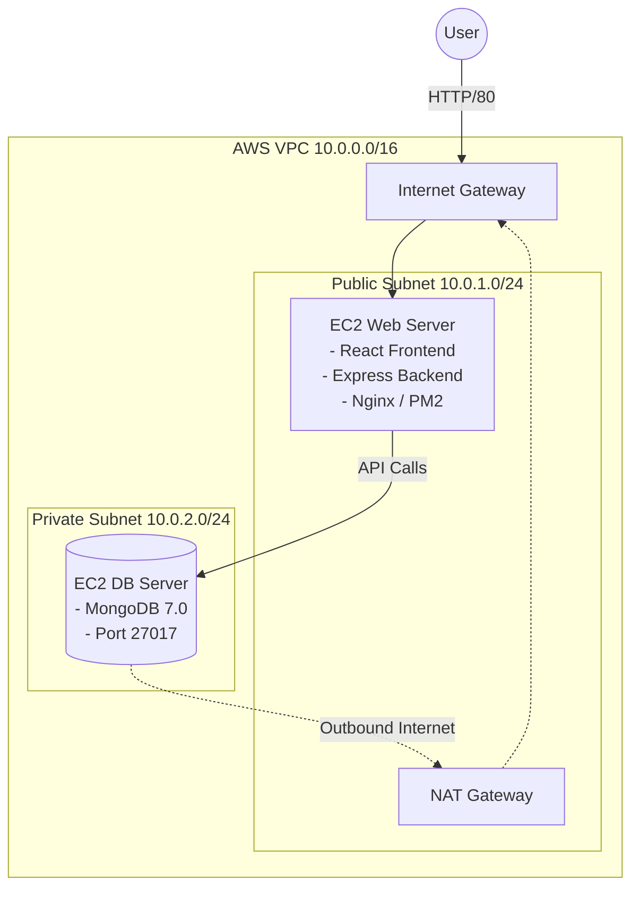

### Component Interaction

| Component | Role | Communication |
|-----------|------|---------------|
| **React Frontend** | User interface served via Nginx on port 80 | Makes API calls to Express backend |
| **Express Backend** | REST API server running on port 3001 via PM2 | Connects to MongoDB on private subnet |
| **MongoDB** | Database storing trip data on port 27017 | Accepts connections only from web server SG |
| **Nginx** | Reverse proxy on port 80 | Routes `/` to React build, `/trip` to Express |
| **PM2** | Process manager | Keeps Express backend running and auto-restarts |

---

## Part 1: Infrastructure Setup with Terraform

### Step 1.1 — AWS CLI Setup & Terraform Initialization

**Actions performed:**
1. Configured AWS CLI with `aws configure`
2. Initialized Terraform project with `terraform init`

**📸 Screenshots:**

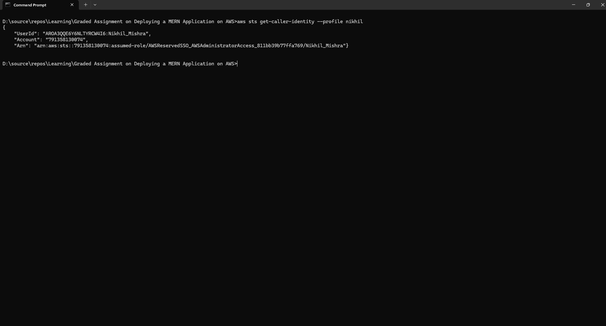
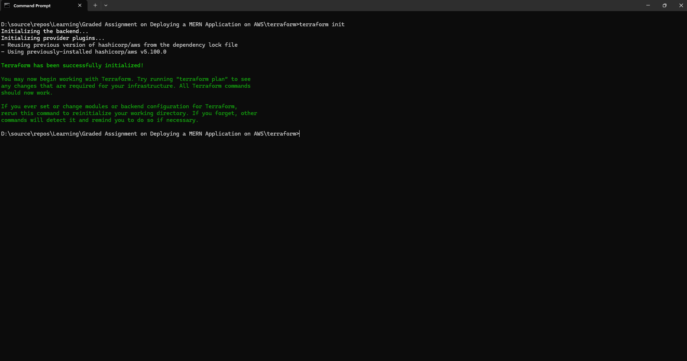

---

### Step 1.2 — VPC and Network Configuration

**Resources created:**
- VPC with CIDR `10.0.0.0/16`
- Public Subnet (`10.0.1.0/24`) with auto-assign public IP
- Private Subnet (`10.0.2.0/24`)
- Internet Gateway attached to VPC
- NAT Gateway in public subnet with Elastic IP
- Route tables for both subnets

**Terraform file:** `terraform/vpc.tf`

**📸 Screenshots:**

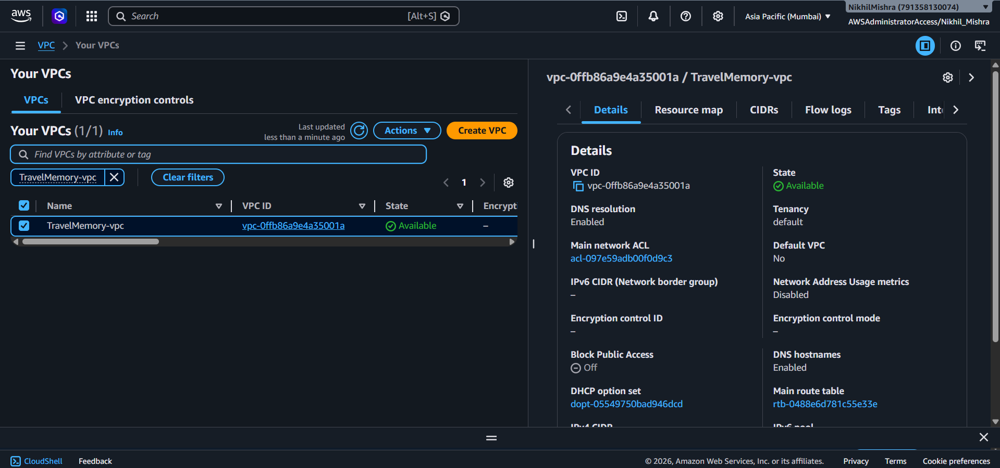
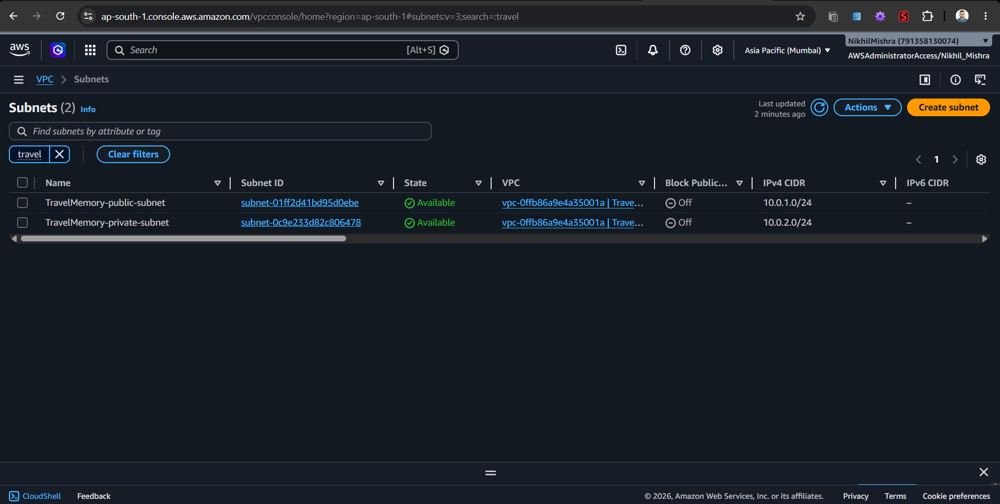
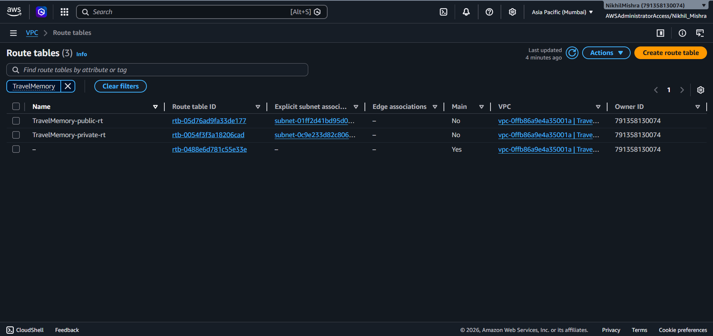

---

### Step 1.3 — Security Groups

**Web Server Security Group rules:**
| Direction | Port | Source | Purpose |
|-----------|------|--------|---------|
| Inbound | 22 | My IP/32 | SSH |
| Inbound | 80 | 0.0.0.0/0 | HTTP |
| Inbound | 3000 | 0.0.0.0/0 | React |
| Inbound | 3001 | 0.0.0.0/0 | Express API |
| Outbound | All | 0.0.0.0/0 | All traffic |

**Database Security Group rules:**
| Direction | Port | Source | Purpose |
|-----------|------|--------|---------|
| Inbound | 22 | Web SG | SSH (bastion) |
| Inbound | 27017 | Web SG | MongoDB |
| Outbound | All | 0.0.0.0/0 | All traffic |

**Terraform file:** `terraform/security-groups.tf`

**📸 Screenshots:**

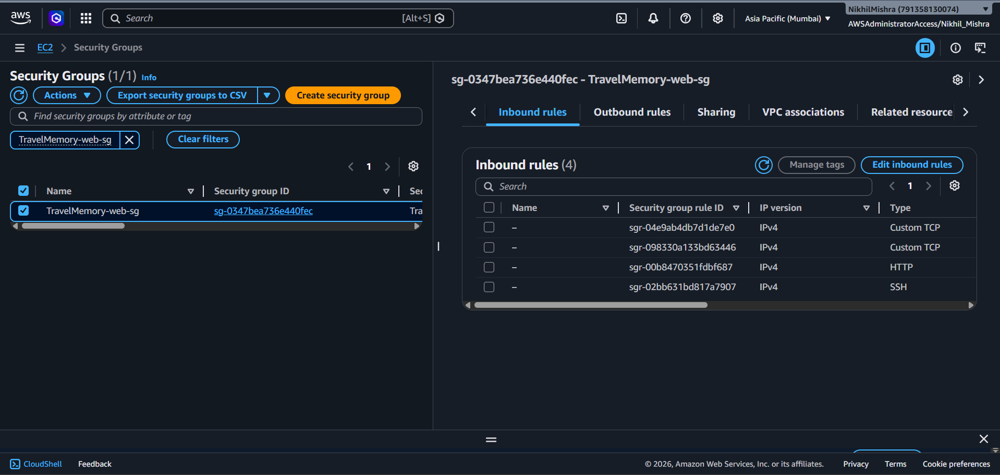
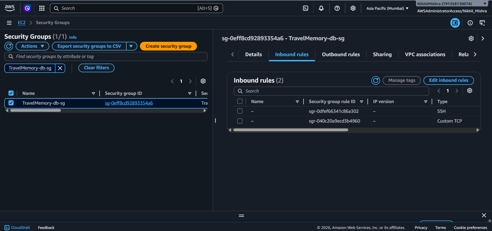

---

### Step 1.4 — IAM Roles

**Created:**
- IAM Role: `TravelMemory-EC2-Role` with EC2 assume role policy
- Attached Policy: `AmazonSSMManagedInstanceCore`
- Instance Profile: `TravelMemory-EC2-Profile`

**Terraform file:** `terraform/iam.tf`

**📸 Screenshots:**

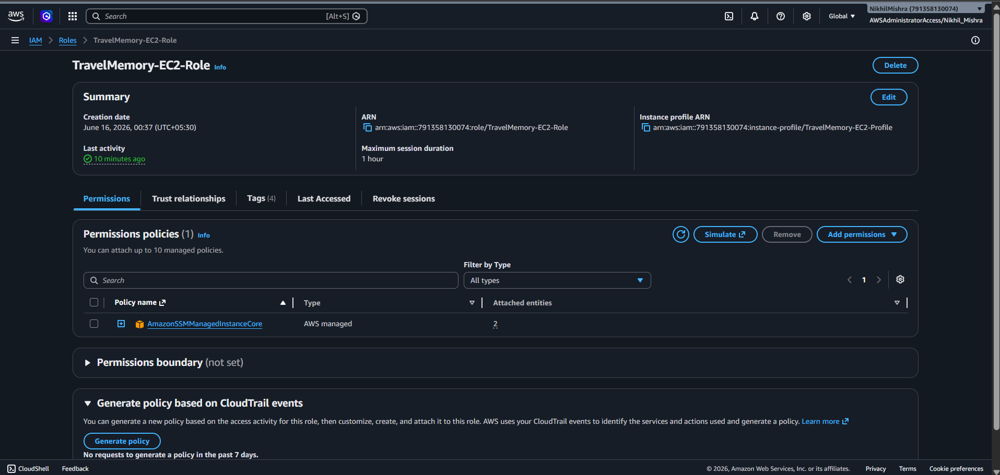

---

### Step 1.5 — EC2 Instance Provisioning

| Instance | Type | Subnet | AMI | Public IP |
|----------|------|--------|-----|-----------|
| WebServer | t2.micro | Public | Ubuntu 22.04 | Yes |
| DBServer | t2.micro | Private | Ubuntu 22.04 | No |

**Terraform file:** `terraform/ec2.tf`

**📸 Screenshots:**

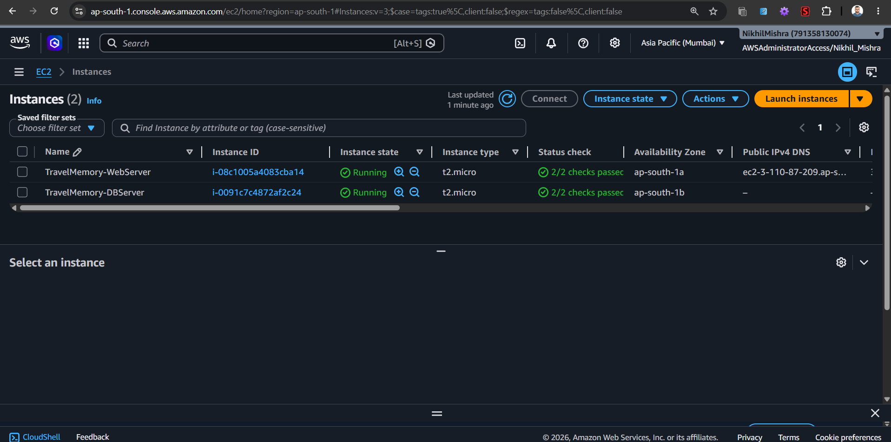

---

### Step 1.6 — Resource Outputs

**Terraform outputs:**
```
web_server_public_ip  = "3.110.87.209"
web_server_private_ip = "10.0.1.x"
db_server_private_ip  = "10.0.2.76"
vpc_id                = "vpc-xxxxxxx"
```

**📸 Screenshots:**

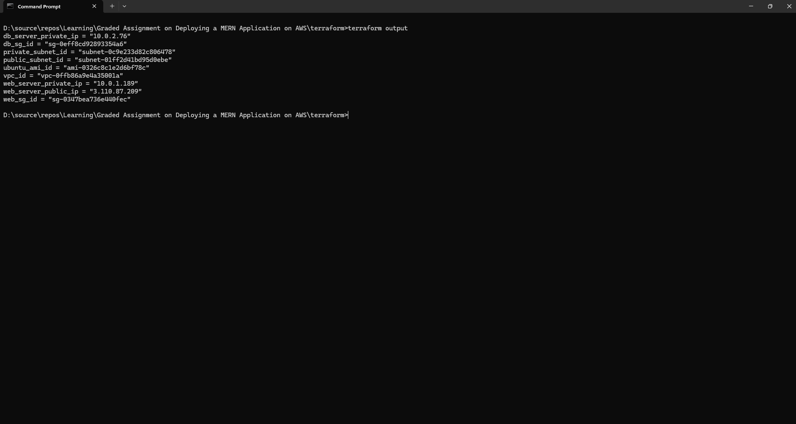

---

## Part 2: Configuration and Deployment with Ansible

### Step 2.1 — Ansible Configuration

**Files created:**
- `ansible/ansible.cfg` — Ansible settings
- `ansible/inventory/hosts.ini` — Inventory with web and DB server IPs

**Connection method:** SSH to web server directly; SSH to DB server via ProxyJump through web server.

**📸 Screenshots:**

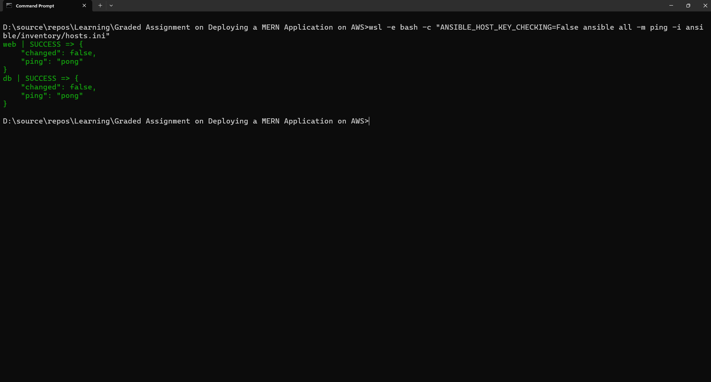

---

### Step 2.2 — Database Server Setup (MongoDB)

**Tasks performed:**
1. Installed MongoDB 7.0 from official repository
2. Configured MongoDB to listen on all interfaces
3. Enabled authentication
4. Created admin user and application user (`appuser`)
5. Created `travelmemory` database
6. Configured UFW firewall

**Ansible playbook:** `ansible/playbooks/dbserver.yml`

**📸 Screenshots:**

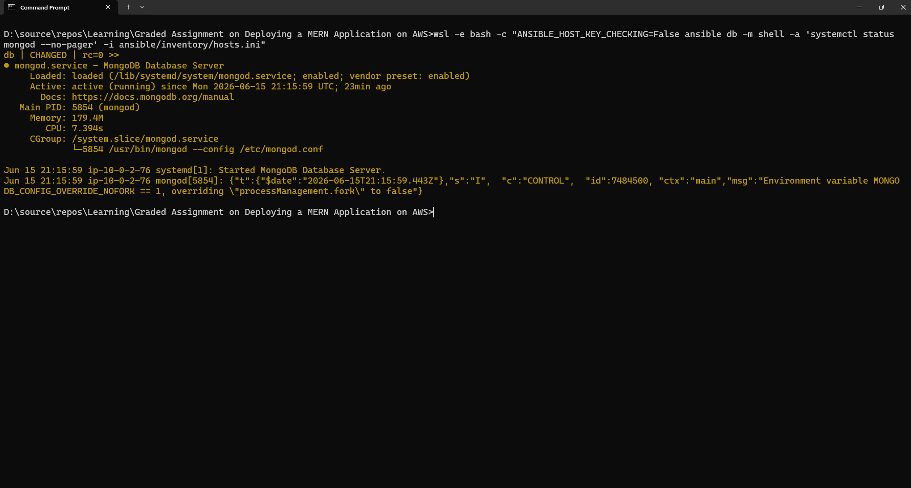

---

### Step 2.3 — Web Server Setup

**Tasks performed:**
1. Installed Node.js 18.x and NPM
2. Installed PM2 process manager
3. Cloned TravelMemory repository
4. Installed backend and frontend dependencies
5. Built React frontend for production
6. Configured Nginx as reverse proxy
7. Started backend with PM2

**Ansible playbook:** `ansible/playbooks/webserver.yml`

**📸 Screenshots:**

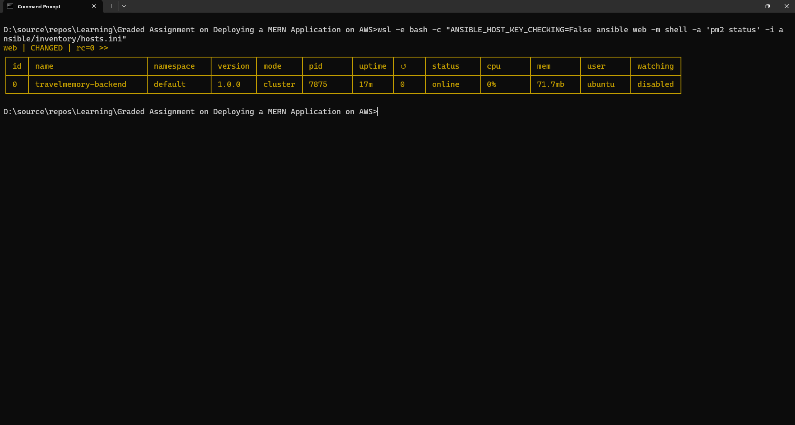

---

### Step 2.4 — Application Deployment & Verification

**Verification performed:**
1. Backend API test: `curl http://<public_ip>:3001/trip` → ✅
2. Frontend accessible: `http://<public_ip>` → ✅
3. Sample data insertion via POST → ✅
4. Data retrieval via GET → ✅

**📸 Screenshots:**

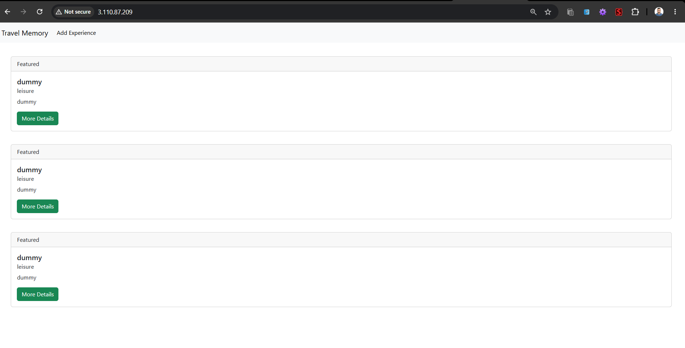
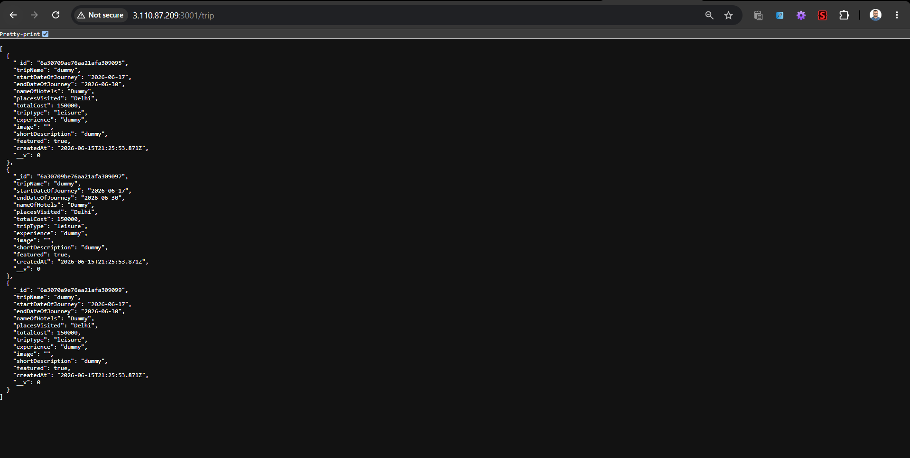

---

## Security Hardening

### Measures Implemented

| Measure | Details |
|---------|---------|
| **SSH Key-Only Auth** | Password authentication disabled |
| **No Root Login** | `PermitRootLogin no` in sshd_config |
| **UFW Firewall** | Enabled on both servers with minimal open ports |
| **Security Groups** | DB server only accessible from web server SG |
| **Private Subnet** | DB server has no public IP, accessed via NAT |
| **MongoDB Auth** | Authentication enabled with separate admin and app users |
| **Encrypted Volumes** | EBS volumes encrypted at rest |
| **Auto Updates** | `unattended-upgrades` enabled for security patches |
| **Env File Permissions** | Backend `.env` file set to mode 0600 |

**📸 Screenshots:**

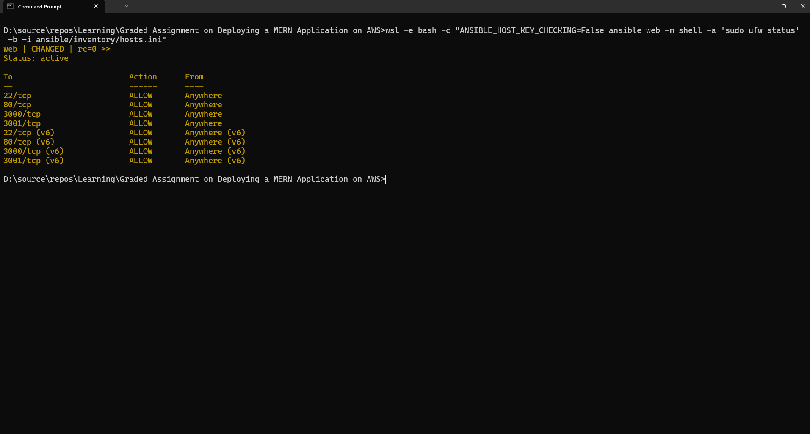

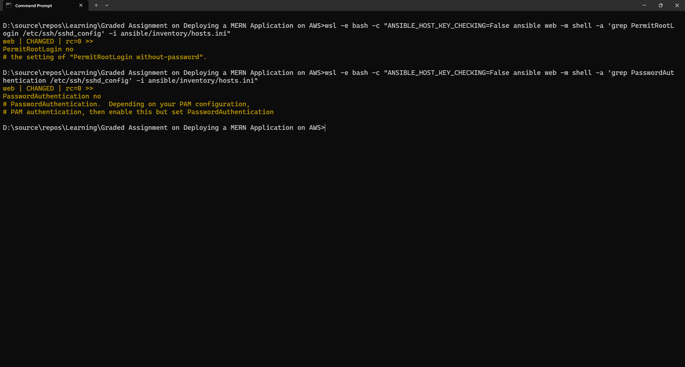

---

## Challenges and Solutions

| Challenge | Solution |
|-----------|----------|
| Accessing DB in private subnet | Used SSH ProxyJump through web server as bastion |
| MongoDB authentication setup | Created users before enabling auth, then restarted |
| React frontend API URL | Updated `url.js` to point to backend's public IP |
| NAT Gateway for private subnet | DB server can download packages via NAT GW |

---

## Conclusion

The TravelMemory MERN application was successfully deployed on AWS using:
- **Terraform** for automated infrastructure provisioning (VPC, EC2, SGs, IAM)
- **Ansible** for configuration management and application deployment (MongoDB, Node.js, Nginx, PM2)

The application is accessible at `http://<web_server_public_ip>` with the React frontend served by Nginx and the Express backend managed by PM2, connecting to MongoDB on a secured private subnet.

---

## Repository

**GitHub Repository:** [https://github.com/nik-hil-10/mern-deploy-aws](https://github.com/nik-hil-10/mern-deploy-aws)

**Files included:**
- `terraform/` — All Terraform infrastructure scripts
- `ansible/` — All Ansible playbooks, templates, and configuration
- `screenshots/` — All verification screenshots
- `report.md` — This report
